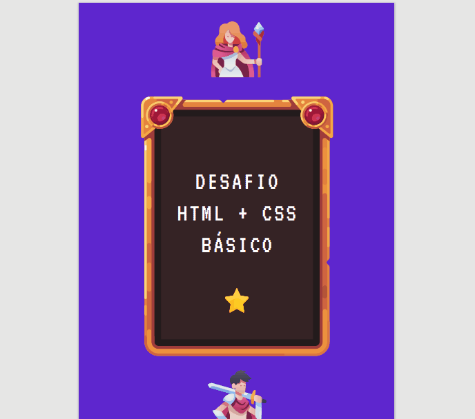

# Desafio-DevQuest-tabelas-estilizadas

## Exercício de criação de tabelas utilizando HTML e CSS

Desafio do curso para desenvolvedores front-end Dev Quest, para a criação de duas tabelas em HTML e estilizadas com CSS.

[]

## Tecnologias Utilizadas

[]
- HTML 5
- CSS 3

